# Praxis

**Open-source educational harness & interactive UI for self-directed coding mastery through Project-Based Learning — with AI that helps humans learn.**

A local, repo-native EdTech system — not a hosted course platform. It pairs a **validated content pipeline** with a **React learning UI** and a **Cursor Agent harness** for tutoring, project correction, and curriculum authoring.

**Why this exists:** models are trained on human knowledge at scale; staying relevant means **reskilling** continuously. This project flips the usual story — instead of only extracting value *from* learners, it uses AI as a **response that puts the human back at the center**: Socratic tutoring, rubric-based project correction, and multi-language study support so newcomers, hobbyists, and professionals migrating into tech can practice, prove understanding, and grow in an AI-driven landscape.

---

## At a glance

| Audience | What you find here |
|----------|-------------------|
| **New developers & hobbyists** | Graph-driven path, predict-first lessons, quizzes, CLI projects with AI correction, Socratic tutor, points & Pomodoro |
| **Professionals reskilling / migrating into tech** | Structured practice, measurable progress, mentor-style AI review without spoiling the struggle of learning |
| **Content authors & contributors** | Graph-aligned scaffolding, validators, authoring skills — [Getting Started →](docs/GETTING_STARTED.md) |
| **Recruiters & tech leaders** | Clean architecture, progress artifacts, extensible open harness, EdTech product thinking |

Two complementary systems:

| Layer | Role | Key paths |
|-------|------|-----------|
| **Educational harness** | Validates curriculum, scaffolds PBL content, persists scores, powers AI workflows | [`graph/`](graph/), [`scripts/`](scripts/), [`tests/`](tests/), [`.cursor/`](.cursor/) |
| **Interactive UI** | Navigation, lessons, quizzes, project workspace, progress & focus tools | [`frontend/`](frontend/) |

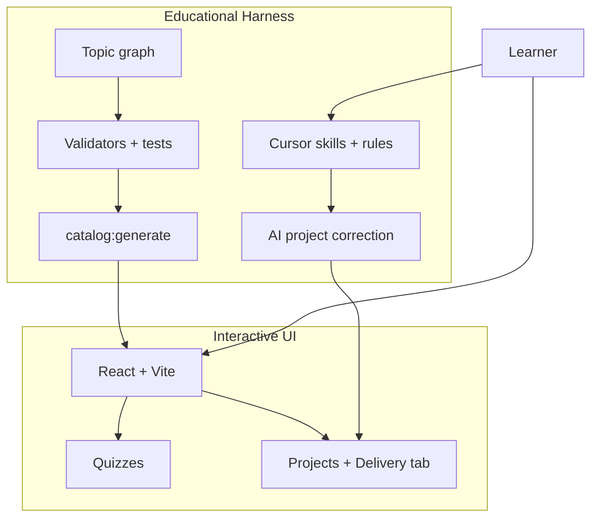

**Content hierarchy:** `Course → Module → Lesson → (explanation, projects, quiz)` plus `Course → MockTestModule → sections` — see [`COURSE_STRUCTURE.md`](COURSE_STRUCTURE.md).

---

## How it's built

### Architecture

- **Content-on-disk** — curriculum as Markdown, JSON, and Node.js starters; no production backend or database
- **Static catalog** — `catalog:generate` syncs `course/` into JSON consumed by the UI
- **Dev-time persistence** — Vite plugins write quiz scores, project deliveries, and the UI locale (→ `.cursor/language.json`) back to the filesystem
- **Frontend layers** — `domain → application → presentation → infrastructure`; URL-driven navigation; injectable repositories ([`ARCHITECTURE.md`](frontend/ARCHITECTURE.md))

### Harness layers

| Layer | Purpose |
|-------|---------|
| **Content** | [`graph/courses/<slug>.graph.txt`](graph/courses/javascript.graph.txt) per course; validators; `npm test` pipeline |
| **PBL** | Project README contracts; AI correction via `review-course-project` (>80 = pass) |
| **Cursor** | [Skills](.cursor/skills/) + [rules](.cursor/rules/) + Node scripts for tutor, reviewer, and author workflows |

### Tech stack

| Layer | Stack |
|-------|-------|
| UI | React 18, TypeScript, Vite, React Router 7, Zustand, Radix UI, Tailwind |
| Content | Markdown, JSON quizzes, Node.js CLI starters |
| Tooling | Node ESM scripts, `node --test`, Vitest |
| AI | Cursor Agent skills |

### Design & engineering focus

| Area | Highlights |
|------|------------|
| **Frontend** | Feature modules, clean architecture, substitutible data layer (static catalog today, API-ready) |
| **UX** | Hierarchy navigation, progressive disclosure via drawers, deep-linkable URLs ([`ARCHITECTURE-FRONT.md`](frontend/ARCHITECTURE-FRONT.md)) |
| **Design** | Token-driven glass UI, WCAG-conscious contrast, semantic quiz feedback, multi-language UI ([`DESIGN.md`](frontend/DESIGN.md)) |
| **Instructional design** | Prerequisite graph, predict-first lessons, spaced retrieval quizzes, rubric-based PBL (not answer-key matching) |
| **Automation** | Deterministic graph scaffolding, schema validation, integration tests for the authoring pipeline |

**Current scope:** JavaScript course (fundamentals → objects → async). The graph and harness extend to additional course roots.

---

## Languages (UI + Cursor)

The study app and the Cursor agent share one language preference so tutoring and authoring follow the locale you pick in the UI.

| Locale | Language |
|--------|----------|
| `en` | English |
| `pt` | Portuguese |
| `es` | Spanish |
| `zh` | Chinese |

**In the app:** use the language control in the top bar. The choice is stored in browser state (`ed-harness-locale`) and applied to chrome, labels, and document `lang`.

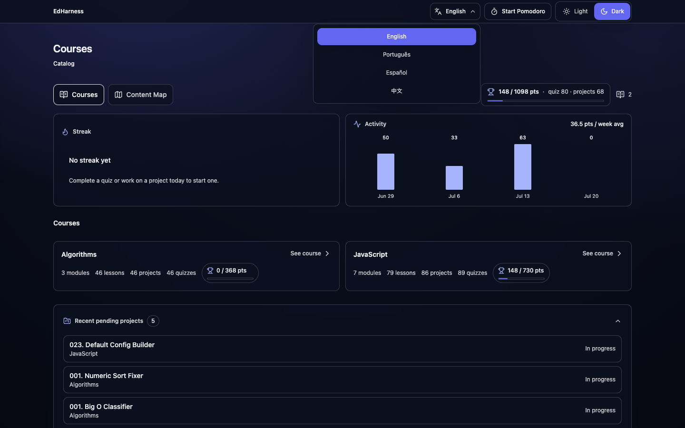

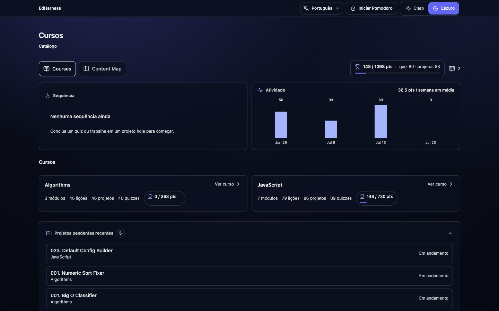

**Bridge to Cursor (dev server):** when Vite is running, changing (or loading) the locale POSTs to `/api/locale`, which writes [`.cursor/language.json`](.cursor/language.json). That file is the source of truth for agent prompts.

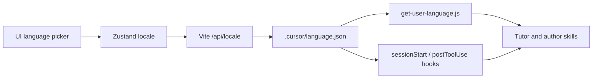

| Piece | Path | Role |
|-------|------|------|
| UI picker | [`LanguageSelector`](frontend/src/presentation/features/shell/LanguageSelector.tsx) | Learner selects `en` / `pt` / `es` / `zh` |
| Sync plugin | [`vite-locale-sync-plugin.mjs`](frontend/scripts/vite-locale-sync-plugin.mjs) | Persists selection to `.cursor/language.json` |
| Tool | [`.cursor/tools/get-user-language.js`](.cursor/tools/get-user-language.js) | Resolves preference (`language.json` → env → `en`); `--prompt` / `--set` |
| Hooks | [`.cursor/hooks.json`](.cursor/hooks.json) | Injects `CURSOR_RESPONSE_LANGUAGE` and response-language context into agent sessions |

**Resolution order for the agent:** `.cursor/language.json` (platform sync) → `CURSOR_RESPONSE_LANGUAGE` / `ED_HARNESS_LANGUAGE` → `en`.

**Typical flow:** `npm run dev` → pick a language in the UI → start a **new** Cursor chat (or wait for the hook refresh after the file changes) so the tutor answers in that language. Manual override without the UI:

```bash
node .cursor/tools/get-user-language.js --set en
node .cursor/tools/get-user-language.js --prompt
```

By default, the preference drives **UI chrome** and **agent chat**. To translate **course content on disk** into the current preferred language, copy the prompt below into a Cursor agent chat.

### Copy-paste prompt: translate course to current language

Set the language in the app (or via `--set`), then paste:

```text
Translate the full course into my current preferred language.

1) Resolve the target language with the project script (do not guess):
   node .cursor/tools/get-user-language.js --json
   node .cursor/tools/get-user-language.js --prompt
   Use the returned `language` / `label` as the only target locale for this job.

2) Scope — translate all learner-facing prose under course/ for every course present (e.g. course/javascript/, course/algorithms/), including:
   - module and lesson README.md
   - projects/**/README.md and other learner-facing Markdown
   - quiz/quiz.json fields shown to learners (question text, options, explanations)
   - human-readable titles/descriptions in *.meta.json when present
   Do this systematically module-by-module so nothing learner-facing is left in the source language.

3) Do NOT translate or rename:
   - code, identifiers, CLI commands, file paths, folder names, graphIndex values
   - test fixtures (starter/tests.json expected I/O, sample.input) unless the prompt text itself is learner-facing UI copy
   - graph/courses/*.graph.txt node labels (keep graph as authored)
   - package.json, scripts, or harness/tooling files

4) Quality rules:
   - Keep predict-first lesson structure, headings hierarchy, Mermaid/ASCII diagrams (translate labels inside diagrams)
   - Preserve Markdown/JSON validity; do not change quiz option ids or scoring shape
   - Prefer natural phrasing in the target language; keep technical terms that are conventionally left in English in that locale
   - After each module (or lesson batch), briefly list what changed; continue until the whole course tree is done
   - If a file is already in the target language, skip it

5) When finished, summarize: target language, courses touched, counts of README / quiz / meta files updated, and any files skipped with reason.
```

After a large translation pass, regenerate the catalog if the UI lists titles from generated JSON: `npm run catalog:generate`.

---

## How learning works

### UI tour

Learner flow in the interactive UI (full set in [`assets/ui/`](assets/ui/)):

**1. Catalog** — dashboard, course cards, pending projects

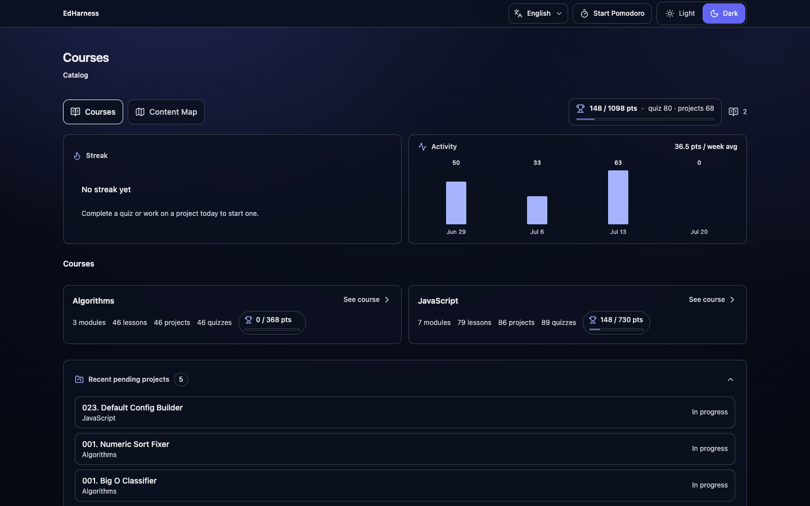

**2. Content map** — curriculum graph with progress

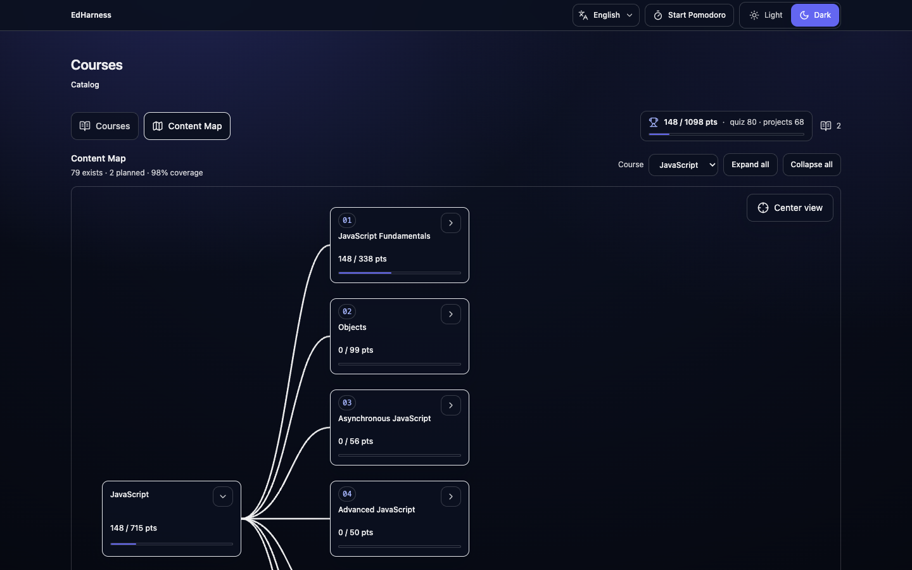

**3. Course overview** — modules and mock tests

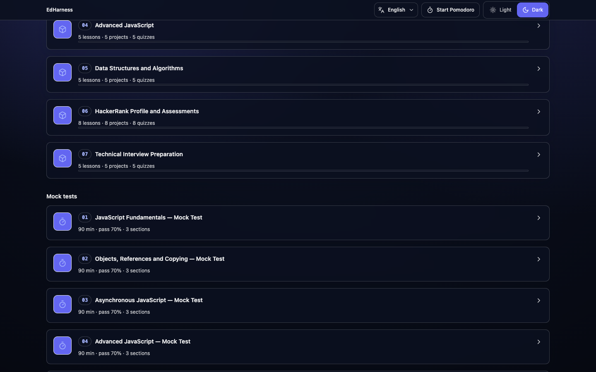

**4. Module** — README + contents drawer

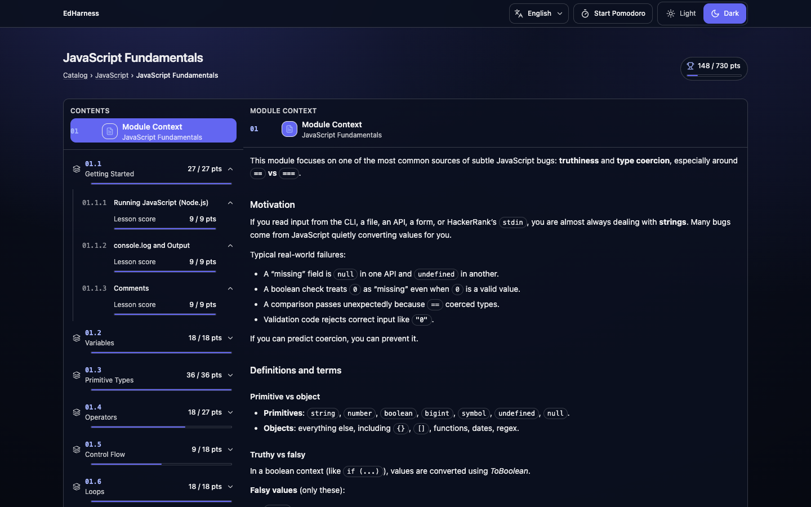

**5. Lesson → quiz → project**

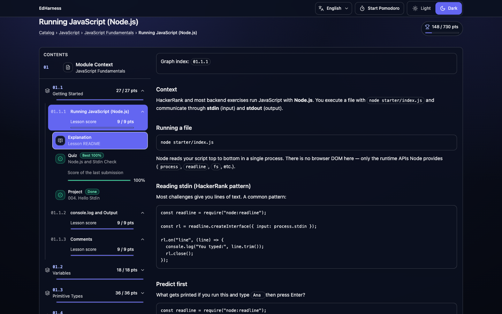

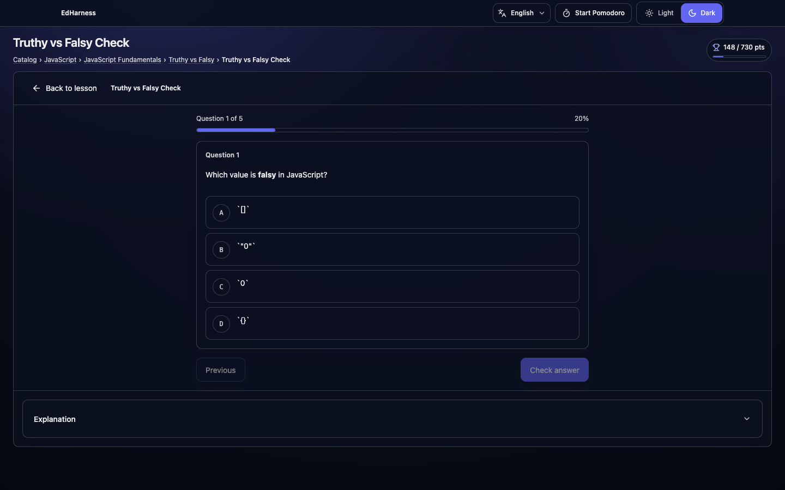

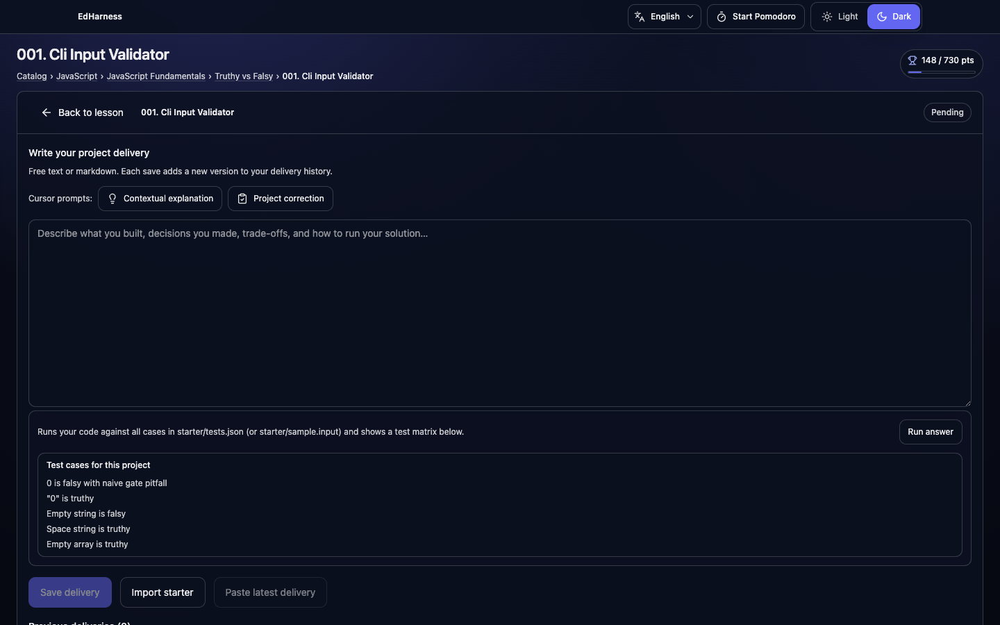

**6. Mock test** — instructions → MCQ → coding

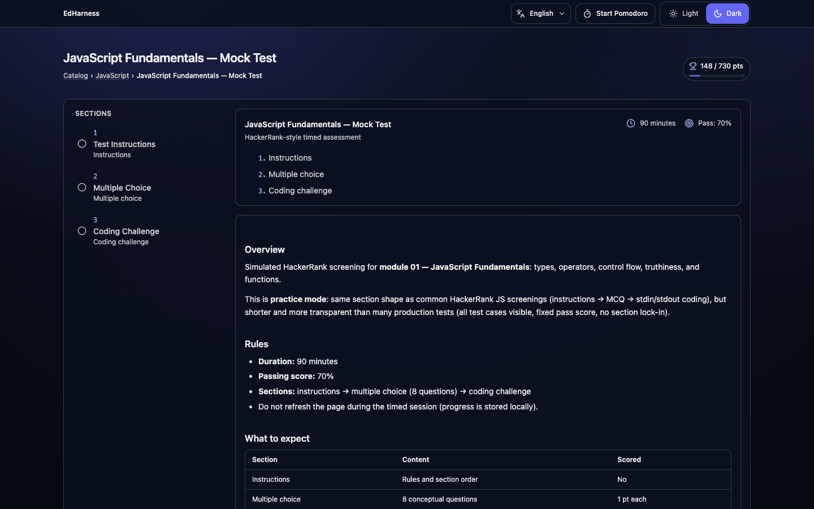

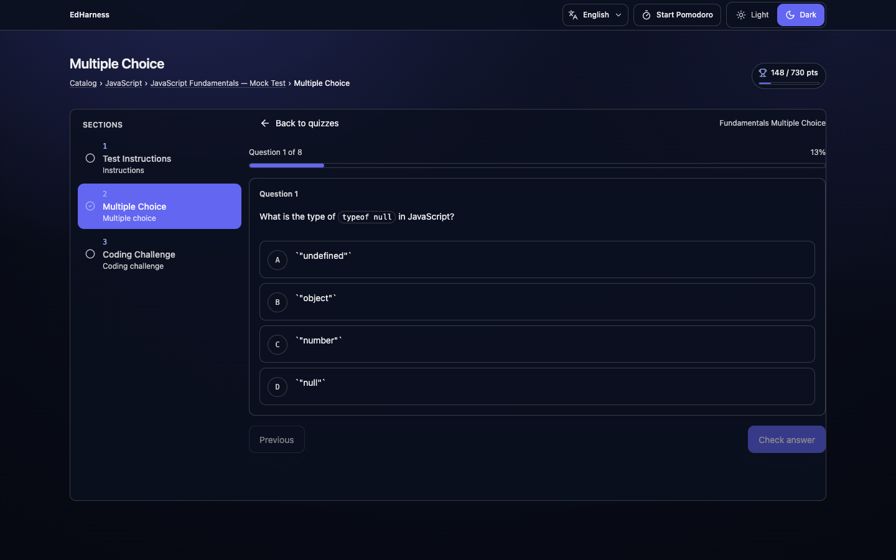

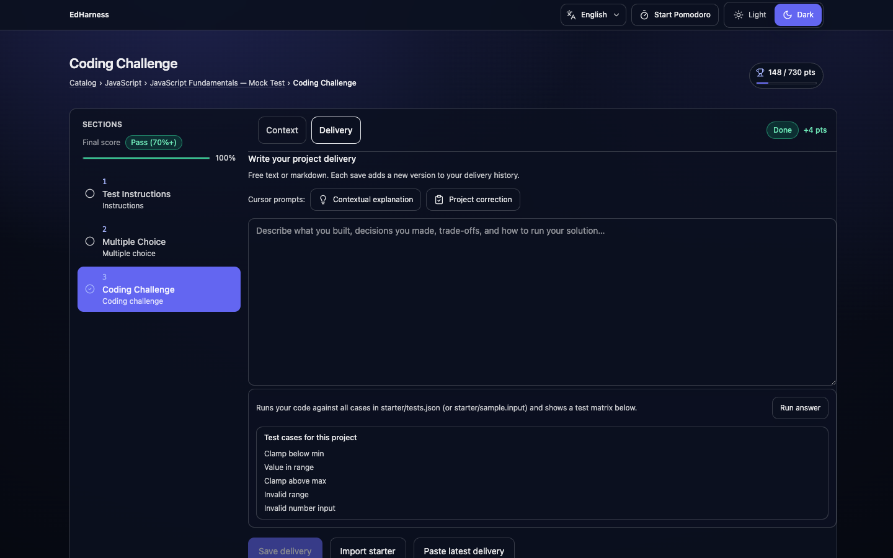

**7. Top bar** — language picker and Pomodoro focus timer


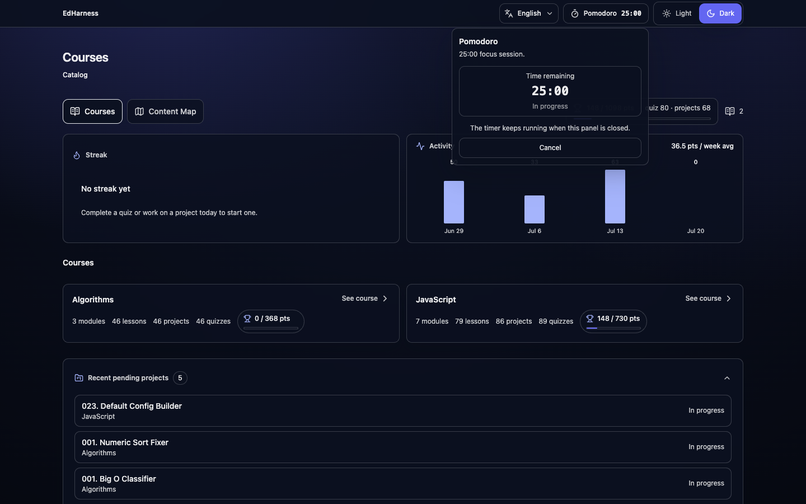

Regenerate after UI changes (Vite on `http://localhost:5173`, Playwright required):

```bash
npm install --no-save playwright@1.49.1
npx playwright install chromium
npm run ui:snapshots
```

### Session flow

1. **Read** a predict-first lesson in [`course/`](course/)
2. **Quiz** — interactive check with explanations on wrong answers
3. **Build** in the delivery draft (import `starter/index.js` as a starting point), validate with Delivery **Run answer** (`starter/tests.json`), save a delivery write-up in the **Delivery** tab
4. **Correct** — request AI review (`@review-course-project` or the Delivery tab **Project correction** button); iterate until score **> 80**

Use the **25-minute Pomodoro** in the app header to bound sessions (runs in the background while you navigate):


### Scoring & progress

| Activity | Points | Complete when |
|----------|--------|---------------|
| **Quiz** | 1 pt per correct answer (best attempt counts) | Retake anytime; UI tiers at ≥80% / ≥50% / <50% |
| **Project** | 4 pts when done | AI review score **> 80** / 100 |

**Course total** = quiz best scores + project points. Progress surfaces on the catalog, course overview, and module cards.

**Persistence:** browser state (Zustand) for instant UI; `course/<courseId>/quiz/score.json` for quiz/project status; `project-delivery.json` per project for delivery history and AI reviews.

### AI project correction

Projects are graded like a **mentor code review** — your `starter/` code and delivery write-up against the project README acceptance criteria, not a hidden reference solution.

The `review-course-project` skill collects lesson context, README criteria, starter code, and your **last 3 deliveries**, then saves a **0–100 score** and short actionable comment. Passing reviews mark the project **done** and sync to `score.json`.

| AI role | Skills | When to use |
|---------|--------|-------------|
| **Tutor** | `teacher-socratic`, `find-topics-graph` | Hints and concepts while coding — questions before answers |
| **Reviewer** | `review-course-project` | Rubric-based grade after you submit a delivery |
| **Author** | `create-course-module`, `generate-lesson-teacher`, `create-course-project`, `create-course-quiz` | Scaffold and validate new curriculum from the graph |

Tutor and reviewer are **separate by design**. Learner-facing skills require explicit invocation — the agent will not silently grade or tutor without you asking.

Skill details, example prompts, and commands: [Getting Started →](docs/GETTING_STARTED.md)

---

## Quick start

```bash
cd frontend && npm install
npm run catalog:generate   # sync course/ → static catalog
npm run dev                # open http://localhost:5173
```

From the repo root: `npm run dev` and `npm run catalog:generate` delegate to `frontend/`.

**Suggested rhythm:** one lesson per session; predict before running code; redo low-score quizzes; iterate projects until AI correction passes.

---

## Repository map

```text
ed-harness/
├── assets/ui/              # Learner-flow UI screenshots (README gallery)
├── course/                 # Lessons, PBL projects, quizzes
│   └── javascript/         # Main course (fundamentals → async)
├── graph/                  # Topic taxonomy (source of truth)
├── frontend/               # Interactive UI (Vite + React)
├── landing_page/           # Open-source promo landing (open index.html)
├── scripts/ + tests/       # Harness: validation, graph sync, integration tests
└── .cursor/
    ├── language.json       # UI↔agent language preference (synced via /api/locale)
    ├── hooks/              # sessionStart injects response language into Cursor
    ├── skills/             # AI tutor, reviewer, and author playbooks
    ├── tools/              # Graph, teacher, and get-user-language helpers
    └── rules/              # Agent guardrails (course hierarchy)
```

---

## Documentation

| Doc | Contents |
|-----|----------|
| [**Getting Started**](docs/GETTING_STARTED.md) | Setup, workflow, routes, Cursor skills, commands |
| [COURSE_STRUCTURE.md](COURSE_STRUCTURE.md) | Content hierarchy and metadata contract |
| [assets/ui/](assets/ui/) | UI screenshots of the learner flow |
| [landing_page/LANDINGPAGE_STYLE.md](landing_page/LANDINGPAGE_STYLE.md) | Open-source landing: brand, visual system, UX journey |
| [landing_page/LANDINGPAGE_WIREFRAME.md](landing_page/LANDINGPAGE_WIREFRAME.md) | Landing ASCII wireframes and per-section design notes |
| [landing_page/index.html](landing_page/index.html) | Open in a browser to preview the landing page |
| [frontend/ARCHITECTURE-FRONT.md](frontend/ARCHITECTURE-FRONT.md) | Learner navigation journey |
| [frontend/ARCHITECTURE.md](frontend/ARCHITECTURE.md) | Routes, layers, score persistence |
| [frontend/DESIGN.md](frontend/DESIGN.md) | In-app design tokens, glass UI, quiz feedback |
| [docs/meta-schemas.md](docs/meta-schemas.md) | `*.meta.json` schemas |

---

## License & contribution

This is an **open-source** project: fork it, learn with it, improve the curriculum, and share workflows that help others reskill with AI as a learning partner.

Contributions are welcome — lessons, quizzes, PBL projects, translations, UI fixes, and harness improvements. Extend content via [`graph/courses/<slug>.graph.txt`](graph/courses/javascript.graph.txt) and the authoring skills in [Getting Started](docs/GETTING_STARTED.md); never invent topics outside their graph node. Open an issue or pull request when you have something to add.
