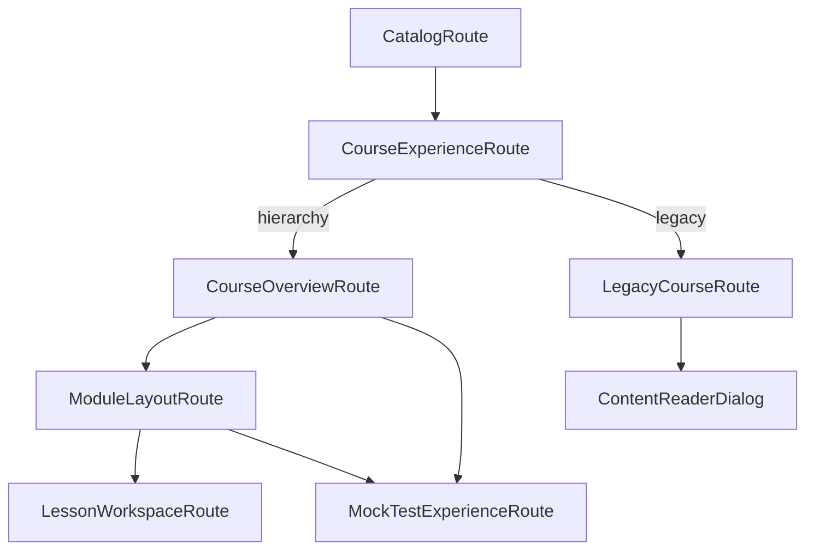

# Arquitetura Frontend — Navegação Fluida para Estudo

Este documento descreve a **arquitetura modular** do frontend do Hackerrank Study, com foco em **como o aluno navega** pelo conteúdo sem perder contexto.

Complementa [`ARCHITECTURE.md`](./ARCHITECTURE.md) (rotas e camadas técnicas), [`../COURSE_STRUCTURE.md`](../COURSE_STRUCTURE.md) (hierarquia de conteúdo no disco) e [`DESIGN.md`](./DESIGN.md) (linguagem visual).

---

## Objetivos

| Objetivo | O que significa na prática |
|----------|----------------------------|
| **Continuidade** | Breadcrumb e URL refletem catálogo → curso → módulo/simulado → lição/seção. |
| **Progressive disclosure** | Visão geral primeiro; quiz, project e arquivos sob demanda (drawer ou overlay). |
| **Um padrão por atividade** | `QuizHost`, `ProjectReader` e `ReadmePanel` unificam shells. |
| **Modularidade** | Features em `presentation/features/` evoluem de forma independente. |
| **Substituibilidade** | Catálogo estático hoje; API e progresso via repositórios injetados. |

---

## Dois fluxos de estudo

O catálogo define `course.structure`:

| Estrutura | Fluxo | Entrada |
|-----------|-------|---------|
| **`hierarchy`** (padrão) | Rotas aninhadas + side drawer | `CourseOverviewRoute` → `ModuleLayoutRoute` ou `mock-test-experience` |
| **`legacy`** | Abas flat + overlay | `LegacyCourseRoute` + `ContentReaderDialog` |



---

## Jornada hierarchy (fluxo primário)

### Overview do curso

```text
/                                    → Catálogo
/course/:courseId                    → Overview: listas Modules + Mock tests
```

O curso expõe **duas listas** no mesmo nível:

| Lista | Origem no catálogo | Exemplo |
|-------|-------------------|---------|
| **Modules** | `course.modules[]` | `01-javascript-fundamentals` |
| **Mock tests** | `course.mockTests[]` | `01-javascript-fundamentals-mock` |

Mock tests vivem em `course/<course>/modules/<id>-mock/` no disco, mas o gerador os separa em `mockTests[]`.

### Módulo de estudo

```text
/course/:courseId/module/:moduleId   → README do módulo + drawer de conteúdos
/course/:courseId/module/:moduleId/lesson/:lessonId → Explanation da lição
  ?drawer=quiz&quiz=<id>             → Quiz no drawer
  ?drawer=project&project=<id>       → Project no drawer
  ?drawerTab=files|delivery          → Aba do project no drawer
```

### Simulado (mock test)

```text
/course/:courseId/module/:moduleId/mock-test
/course/:courseId/module/:moduleId/mock-test/section/:sectionId
```

Três seções fixas por simulado: **instructions** → **quiz** → **coding**. Cada seção reutiliza os mesmos shells das lições de estudo.

**Alinhamento HackerRank:** o simulado reproduz a forma de screenings comuns (MCQ + stdin/stdout), em **modo prática** — ver [create-mock-test reference](../.cursor/skills/create-mock-test/reference.md#hackerrank-alignment).

---

## Níveis de navegação

### Nível 1 — Catálogo

- [`CatalogRoute`](src/presentation/features/catalog/CatalogRoute.tsx)
- Lista cursos; ação **See course** → `/course/:courseId`

### Nível 2 — Overview do curso

- [`CourseOverviewRoute`](src/presentation/features/course-overview/CourseOverviewRoute.tsx)
- Cards de **módulos de estudo** com score (`ModuleScoreSummary`)
- Cards de **simulados** com duração, nota de corte e contagem de seções
- README do curso opcional no rodapé

### Nível 3a — Módulo de estudo

- [`ModuleLayoutRoute`](src/presentation/features/module-experience/ModuleLayoutRoute.tsx) — shell com drawer
- [`ModuleExperienceRoute`](src/presentation/features/module-experience/ModuleExperienceRoute.tsx) — README do módulo
- [`ModuleContentsDrawer`](src/presentation/features/module-experience/components/ModuleContentsDrawer.tsx) — navegação por seções, lições, quiz e project
- Quiz de módulo: `?quiz=<id>` substitui o painel principal por [`QuizHost`](src/presentation/features/quiz/components/QuizHost.tsx) (`layout="page"`)

### Nível 3b — Simulado

- [`MockTestExperienceRoute`](src/presentation/features/mock-test-experience/MockTestExperienceRoute.tsx) — shell com nav de seções
- [`MockTestOverviewRoute`](src/presentation/features/mock-test-experience/MockTestOverviewRoute.tsx) — regras + botão Start
- [`MockTestSectionRoute`](src/presentation/features/mock-test-experience/MockTestSectionRoute.tsx) — conteúdo da seção ativa
- [`MockTestSectionNav`](src/presentation/features/mock-test-experience/components/MockTestSectionNav.tsx) — sidebar com as 3 seções

| `mockTestSection` | Shell | Layout |
|-------------------|-------|--------|
| `instructions` | `ReadmePanel` | inline |
| `quiz` | `QuizHost` | `page` |
| `coding` | `ProjectReader` | `drawer` (Delivery) |

### Nível 4 — Lição de estudo

- [`LessonWorkspaceRoute`](src/presentation/features/lesson-workspace/LessonWorkspaceRoute.tsx)
- Painel central: explanation (`ReadmePanel`) quando drawer fechado
- Drawer aberto: quiz/project ocupam a coluna principal; explanation oculta
- Progress bar da lição: rodapé do side drawer (`LessonProgressFooter`)

---

## Jornada legacy (compatibilidade)

Cursos com `structure: "legacy"` (pastas flat sem `modules/` no gerador):

```text
/course/:courseId?tab=readme|examples|projects|quiz
/course/:courseId?tab=examples&reader=<path>  → ContentReaderDialog overlay
```

- [`LegacyCourseRoute`](src/presentation/features/course-legacy/LegacyCourseRoute.tsx) — abas README / Examples / Projects / Quiz
- [`ContentReaderDialog`](src/presentation/features/course-legacy/ContentReaderDialog.tsx) — overlay global montado em [`AppLayout`](src/presentation/app/AppLayout.tsx) quando `course.structure === "legacy"`

**Regra:** novas features vão apenas no fluxo hierarchy; legacy recebe apenas correções. Simulados não existem no fluxo legacy.

---

## Estado e stores

| Store / hook | Responsabilidade |
|--------------|------------------|
| React Router (`pathname`, `searchParams`) | Rota canônica; URLs compartilháveis |
| [`useAppNavigation`](src/application/hooks/useAppNavigation.ts) | Facade de navegação; delega hierarchy/legacy + `goMockTest` |
| [`useMockTestNavigation`](src/application/hooks/useMockTestNavigation.ts) | Rotas de simulado e seções |
| [`useMockTestRouteData`](src/application/hooks/useMockTestRouteData.ts) | Resolve `mockTest` e seção ativa da URL |
| [`courseCatalogStore`](src/application/stores/courseCatalogStore.ts) | Catálogo + status de carga |
| [`quizSessionStore`](src/application/stores/quizSessionStore.ts) | Sessão ativa do quiz |
| [`quizProgressStore`](src/application/stores/quizProgressStore.ts) | Melhor score e tentativas (localStorage) |
| [`projectProgressStore`](src/application/stores/projectProgressStore.ts) | Status de entrega de projects |
| [`contentReaderStore`](src/application/stores/legacy/contentReaderStore.ts) | Overlay legacy: item, aba, cwd, arquivo |
| [`courseExperienceStore`](src/application/stores/legacy/courseExperienceStore.ts) | Tab persistida (legacy) |

---

## Arquitetura em camadas

```text
presentation/features/     → rotas e UI por domínio
presentation/shared/         → ReadmePanel, AsyncRouteBoundary, MarkdownView
application/hooks/           → useCourseRouteData, useQuizSessionFromUrl, useMockTestRouteData
application/navigation/      → estrategiaHierarquia, estrategiaLegacy
application/stores/        → Zustand (uma responsabilidade por store)
application/selectors/       → catalogSelectors, mockTestSelectors, lessonProgress, quizSelectors
application/usecases/        → courseScores, loadCatalog, projectDeliveries
infrastructure/              → staticCatalogRepository, httpCourseScoreRepository
domain/types/                → catalog, mockTest, quiz, navigation, reader
```

**Regra:** `presentation/` importa apenas `application/` e `domain/`, nunca `infrastructure/` diretamente.

---

## Shells unificados

| Shell | Layouts | Usado em |
|-------|---------|----------|
| `QuizHost` | `page` \| `drawer` | Module quiz, lesson drawer, mock test quiz section, legacy tab |
| `ProjectReader` | `overlay` \| `drawer` | ContentReaderDialog, lesson drawer, mock test coding section |
| `ReadmePanel` | `inline` \| `scroll` \| `card` | Lição, módulo, curso, instructions de simulado, explanation em projects |

---

## Pipeline de conteúdo

```text
course/ → npm run catalog:generate → catalog.json → courseCatalogStore
```

O gerador:

1. Carrega `course/<slug>/modules/*`
2. Separa `-mock` → `course.mockTests[]`; demais → `course.modules[]`
3. Embute `mock-test.meta.json`, `lesson.meta.json` (`mockTestSection`), quizzes e projects

Após editar conteúdo em `course/`, regenerar o catálogo antes de `dev` ou `build`.

---

## Checklist de conformidade

- [ ] UI importa apenas `application/` e `domain/`
- [ ] Novo estado tem store ou hook dedicado com responsabilidade clara
- [ ] Cursos hierarchy: quiz/project via URL + drawer (sem overlay)
- [ ] Simulados: rotas sob `…/mock-test/…`; shells reutilizados
- [ ] Cursos legacy: overlay via `contentReaderStore` até remoção do gerador legacy
- [ ] Tipos novos em `domain/types/` antes da UI
- [ ] Conteúdo novo passa por `catalog:generate` antes do deploy

---

## Gate de remoção legacy

Remover `course-legacy/` somente quando:

1. `catalog.json` não contiver cursos `structure: "legacy"`
2. `generate-static-catalog.mjs` não emitir `loadLegacyModule`
3. Smoke manual do fluxo hierarchy cobrir 100% dos cursos publicados

---

## Mapa mental de arquivos

| Peça | Arquivo |
|------|---------|
| Composição raiz | `src/presentation/app/AppRouter.tsx`, `AppLayout.tsx` |
| Catálogo | `features/catalog/CatalogRoute.tsx` |
| Entrada do curso | `features/course-experience/CourseExperienceRoute.tsx` |
| Overview (duas listas) | `features/course-overview/CourseOverviewRoute.tsx` |
| Hierarchy estudo | `features/module-experience/`, `lesson-workspace/` |
| Simulados | `features/mock-test-experience/` |
| Legacy | `features/course-legacy/` |
| Quiz | `features/quiz/QuizHost.tsx`, `QuizSessionPanel.tsx` |
| Navegação | `application/hooks/useAppNavigation.ts`, `useMockTestNavigation.ts` |
| Selectors | `application/selectors/mockTestSelectors.ts`, `catalogSelectors.ts` |
| Catálogo (dados) | `application/stores/courseCatalogStore.ts` |
| Gerador | `scripts/generate-static-catalog.mjs` |

Para detalhes de rotas e scores, ver [`ARCHITECTURE.md`](./ARCHITECTURE.md). Para layout no disco, ver [`../COURSE_STRUCTURE.md`](../COURSE_STRUCTURE.md). Para tokens visuais, ver [`DESIGN.md`](./DESIGN.md).
